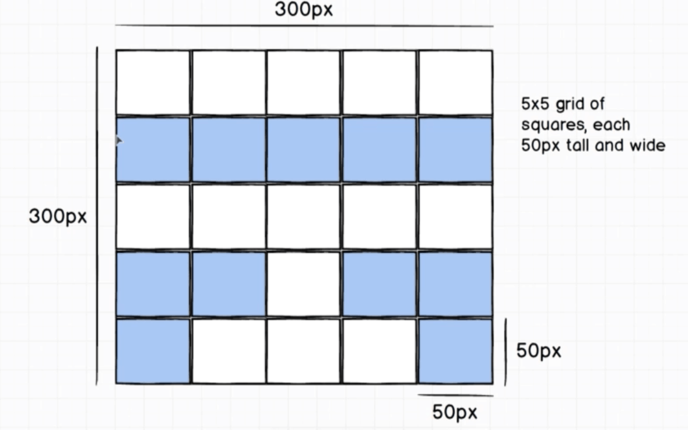
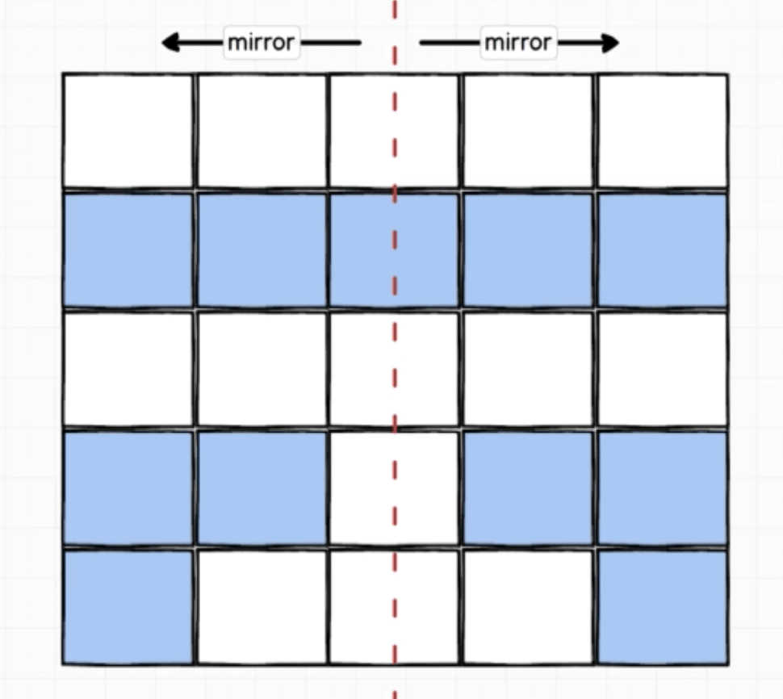
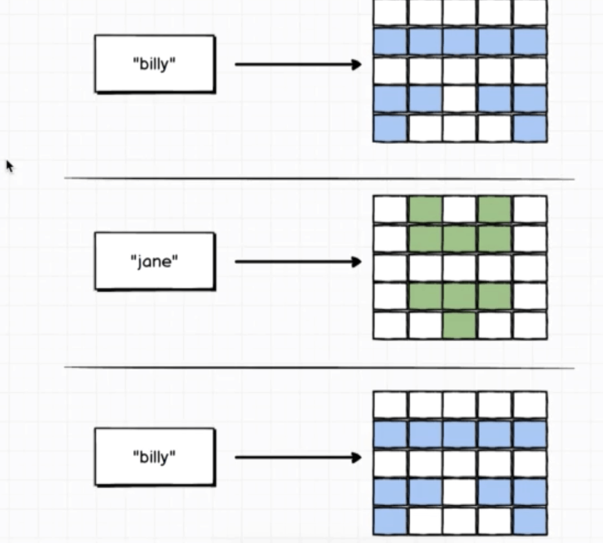
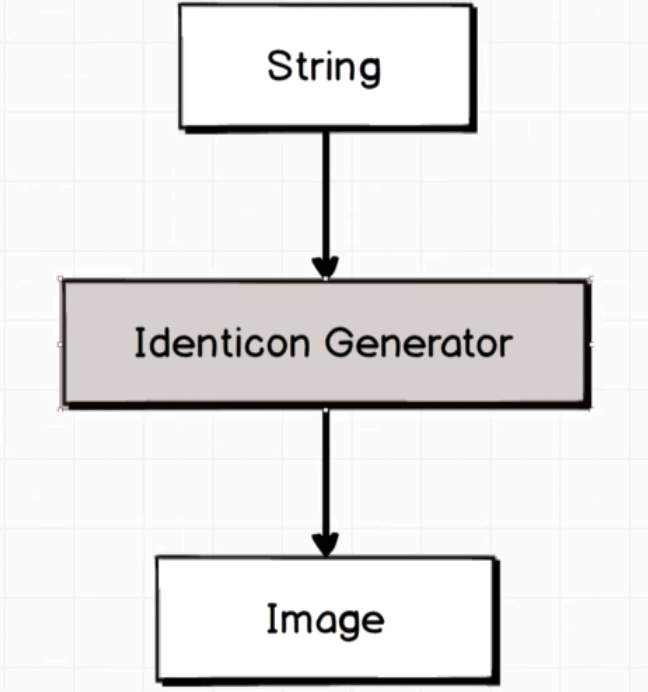
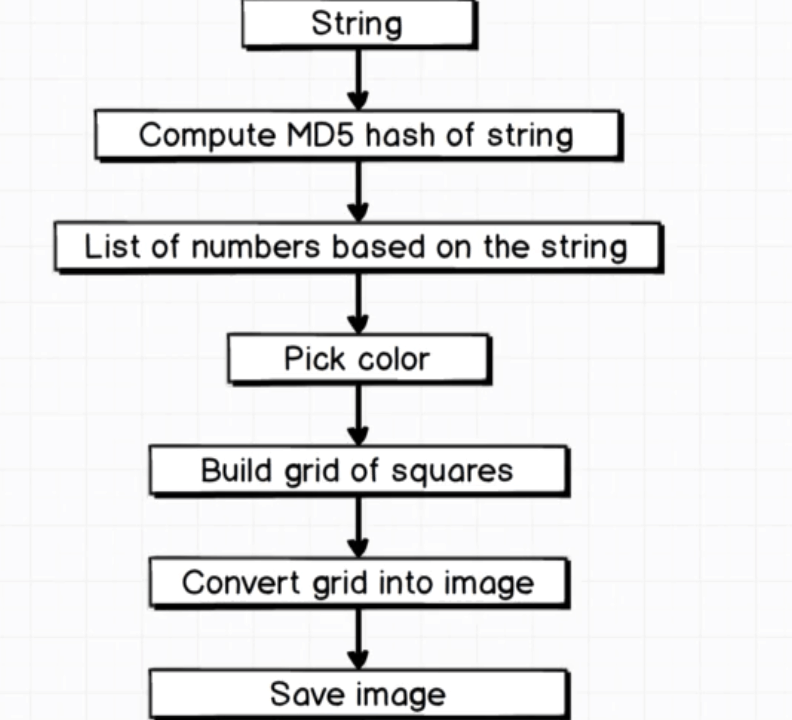

# Identicon

Will randomly generety and image/avatar

## Installation

If [available in Hex](https://hex.pm/docs/publish), the package can be installed
by adding `identicon` to your list of dependencies in `mix.exs`:

```elixir
def deps do
  [
    {:identicon, "~> 0.1.0"}
  ]
end
```

Documentation can be generated with [ExDoc](https://github.com/elixir-lang/ex_doc)
and published on [HexDocs](https://hexdocs.pm). Once published, the docs can
be found at [https://hexdocs.pm/identicon](https://hexdocs.pm/identicon).

## Mockups

This will randoly generatr an avatar profile for the user



Each identicon/avatar should NOT be randonly generated unless is the first time.



Once it's generated will always return the same identicon for the same user



Flow of the application



## Generation process

We will get a string and we'll pass it to a series of individual functions and organize them toguether to return an image.

